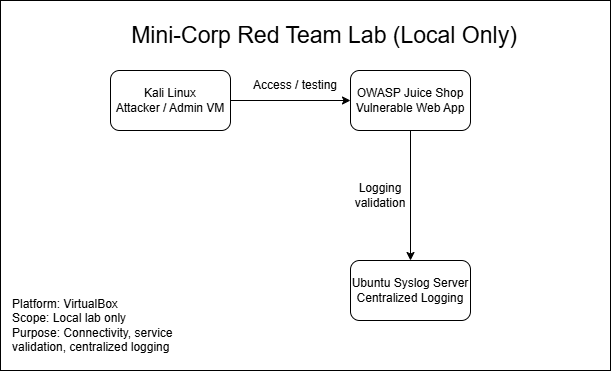
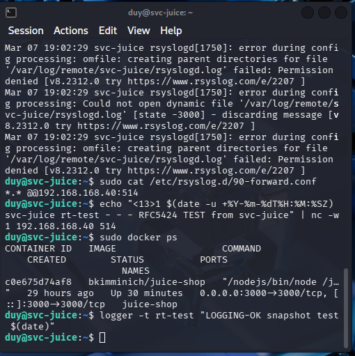
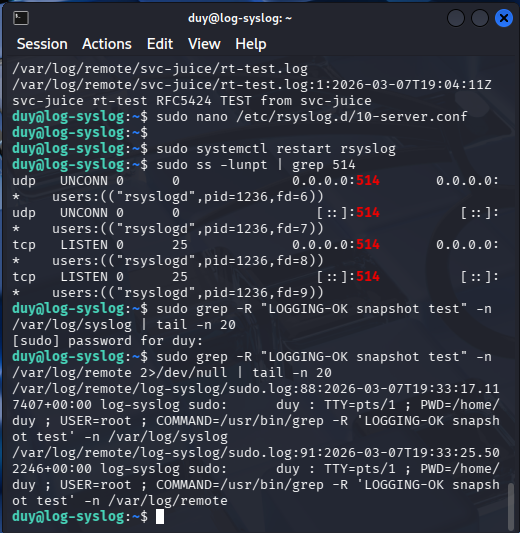
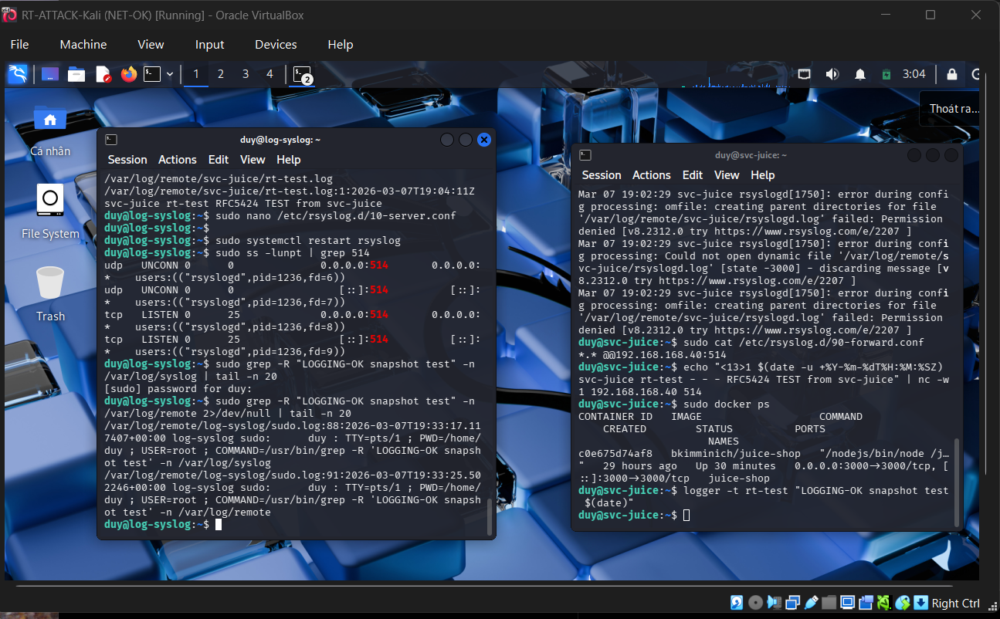

# Red Team Lab Foundation (Mini-Corp)

## Overview
Personal red team lab to practice VM operations, basic networking validation, and centralized logging in a safe local environment.

## Scope (Lab-only)
This lab is for local VMs only. No real-world targets. No credential harvesting.

## Current Lab Components
- 1 attacker/admin VM: Kali Linux
- 1 vulnerable service VM: OWASP Juice Shop
- 1 log server VM: Ubuntu syslog server

## Tech Stack
- Hypervisor: VirtualBox
- Networking: internal lab connectivity validation
- Logging: centralized syslog
- Target app: OWASP Juice Shop

## What was completed
- Brought up the core lab VMs
- Verified network connectivity
- Verified Juice Shop service availability
- Verified logging server operation
- Captured validation screenshots
- Created the initial lab diagram

## Deliverables
- Network diagram: docs/diagrams/
- Reports / notes: docs/reports/
- Validation screenshots: docs/screenshots/

## Diagram

The diagram below shows the current foundation lab layout used for validation and logging checks.

## Evidence

### Juice Shop OK

### Logging OK

### Network OK

## Status
- [x] Core lab VMs running
- [x] Network validation completed
- [x] Juice Shop validation completed
- [x] Logging validation completed
- [x] Validation screenshots added
- [x] Diagram
- [ ] Runbook